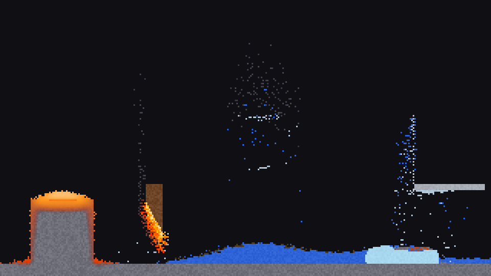
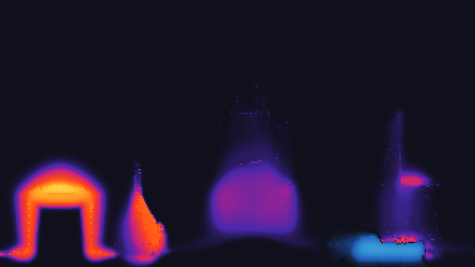

---
tags:
  - 만든 것
---

# 모래

!!! abstract "개요"
    **모래**는 [세준](세준.md)이 2026년 7월에 만든 물질 시뮬레이터다.
    픽셀 하나하나가 물질이고, 칸마다 온도를 들고 있다.
    C++와 SDL2로 만들었으며 물질 25종, 열, 배선과 논리 게이트가 들어 있다.



*왼쪽부터 — 돌 위에 부은 용암, 밑동이 타는 나무 기둥, 기름이 뜬 물웅덩이,
얼음, 오른쪽 위에 금속 막대. 용암의 열이 밑돌을 벌겋게 달구고 있다.*

## 1. 개요

화면의 픽셀 한 칸이 각각 하나의 물질이다. 모래는 쌓이고, 물은 퍼지고,
기름은 물 위에 뜨고, 불은 닿는 것을 데우고, 데워진 것은 스스로 불붙거나
녹거나 끓는다.

규칙은 픽셀 하나당 몇 줄뿐인데 화면 전체는 살아 있는 것처럼 보인다.
이런 종류를 흔히 *falling sand* 라고 부른다.

그리드는 320×180이고 4배로 확대해서 보여 준다. 한 프레임에

1. 물질이 움직이고
2. 열이 퍼지고 식고
3. 온도에 따라 상태가 바뀌고
4. 배선에 신호가 흐른다

심심해서 만들었다.

## 2. 물질

25종이 있다. 성질은 표 한 줄로 정해진다 — 색, 밀도, 열전도, 발화점,
식는 빠르기, 열용량.

| 갈래 | 물질 |
|------|------|
| 가루 | 모래, 화약 |
| 액체 | 물, 기름, 산, 용암, 녹은유리 |
| 고체 | 돌, 나무, 금속, 유리, 얼음, 식물, 배선, 전원, 게이트 넷 |
| 기체 | 불, 파란불, 전기, 연기, 증기 |

밀도가 큰 것이 작은 것을 밀어내며 가라앉는다. 기름 4 < 물 5 < 용암 8 < 모래 9
이라서 기름이 물 위에 뜨고 용암은 물에 가라앉는다.

### 2.1. 불은 특별하지 않다

**불은 그냥 900도인 것**이다. 옆 칸에 옮겨붙는 코드가 따로 없다.
열이 퍼져서 나무가 300도, 기름이 200도를 넘으면 스스로 붙는다.

덕분에 새 물질을 넣을 때 상호작용 표를 고칠 필요가 없다.
발화점 숫자 하나만 적으면 된다. 파란불(2000도)은 같은 구조로
돌(1200도)과 금속(1500도)까지 녹인다.

### 2.2. 붓 우선순위

붓은 자기보다 단단한 것을 못 덮는다.

```
공기 < 기체 < 액체 < 가루 < 고체
```

돌 위에 불을 대도 돌이 사라지지 않는다. 대신 **그 물질의 온도를 준다.**
그래서 돌은 벌겋게 달아오르고, 나무는 발화점을 넘어 스스로 붙고,
물은 끓고, 용암을 오래 대고 있으면 돌이 녹는다.
물질별 특례 없이 이 규칙 하나로 다 나온다.

## 3. 열

칸마다 섭씨 온도를 들고 있다. 이웃 넷과 열을 섞고, 온도가 경계를 넘은 채로
얼마간 버티면 다른 물질이 된다(물 100도에서 증기, 0도에서 얼음, 돌 1200도에서 용암 …).

### 3.1. 열용량

칸이 온도만 들고 있으면 뭐든 순식간에 온도가 바뀐다. 붓으로 찍은 작은
용암 방울이 5초도 못 가 돌이 됐다.

물질마다 **열용량**을 두고 들어온 열을 그것으로 나눴다. 같은 열을 받아도
많이 머금는 것은 온도가 조금만 오른다. 용암은 4, 물은 3, 금속은 1이다.
용암 방울이 굳는 시간이 4.6초에서 15초가 됐다.

### 3.2. 겉부터 식는다

**복사는 겉면에서만 일어난다.** 속에 파묻힌 칸은 이웃하고만 열을 주고받는다.

이게 있어야 덩어리가 통째로 균일하게 녹지 않고 겉부터 한 겹씩 벗겨지듯
녹는다. 900도로 달군 돌덩이는 1500프레임 뒤 겉이 455도, 속이 617도다.
한 겹짜리 돌벽은 온 면이 드러나 있어서 30도까지 식는다.

그리고 **찬 것도 바깥에서 열을 받아야 한다.** 뜨거울 때만 식게 해 놓았더니
얼음덩이가 제 주변 공기를 -60도로 붙잡아 놓고 열이 들어올 틈을 안 줘서
영영 안 녹았다.

## 4. 배선과 게이트

배선에 신호 세기가 있다. 전원에 닿은 칸이 최대고 한 칸 멀어질 때마다
1씩 줄어 0이 되면 끊긴다. 전원에 가까울수록 밝게 보인다.

세기를 둔 것이 핵심이다. 켜짐/꺼짐만 두면 고리 모양으로 이은 선이 서로를
켜 주며 **전원 없이도 영영 켜져 있는다.** 세기는 반드시 어딘가에서 흘러온
것이라 그런 일이 안 생긴다.

게이트 넷(AND · OR · NOT · XOR)은 그리는 게 아니라 **설치한다.**
3×3 몸통에 입력 꽁다리 둘, 출력 꽁다리 하나가 같이 깔린다.
`R` 로 방향을 돌리고, 커서 자리에 놓일 모양이 미리 비친다.

판단은 한 프레임 늦게 반영된다. 실제 회로에도 지연이 있고, 이게 없으면
되먹임 고리에서 한 프레임 안에 무한히 돌게 된다.
NOT 을 자기 출력에 물리면 깜빡이가 된다.

배선도 물질이라 1500도가 넘으면 녹아 끊긴다. 불로 회로를 태울 수 있다.

## 5. 액체를 네 번 다시 짰다

이 프로젝트에서 가장 오래 붙잡은 부분이다. 지금 쓰는 방식은 제일 단순한 것이고,
그 사이에 시도한 넷은 전부 이것보다 나빴다.

액체는 모래와 거의 같게 돈다 — 아래로, 안 되면 대각선 아래로, 안 되면 옆으로.
이 방식에는 [알려진 한계](https://w-shadow.com/blog/2009/09/01/simple-fluid-simulation/)가 있다.

> water falling into a basin will form a little "hill" and spread out slowly,
> instead of near-instantly as real water would

그릇에 부은 물이 봉긋한 언덕으로 쌓이고, 다 가라앉은 뒤에도 수면 맨 윗줄이
좌우로 조금 떤다. 칸이 차 있다/비어 있다 두 가지뿐이라 "여기가 저기보다
높다" 를 표현할 방법이 없기 때문이다. Noita 도 같은 방식이다.

**옆으로 갈 조건 붙이기**
:   떨림은 없어지는데 물이 안 퍼진다. 한 겹 깔린 물이 앞을 막고,
    물은 물을 못 민다. 조건을 풀면 다시 떤다. 이 둘을 한참 왔다 갔다 했다.

**칸마다 양을 담기**
:   수면이 완벽히 평평해지고 떨림도 0이 됐다. 대신 물이 치약처럼 짜여 내려간다.
    관성이 없어서 덩어리째 떨어지질 못한다.

**나비에-스토크스 + 압력 투영**
:   속도장을 얹고 압력 방정식을 풀었다. 격자에 양을 실어 나르니 수치 확산으로
    물덩이가 안개가 됐다가 사라졌다. 그래서 물을 알갱이로 들고 격자는 압력만
    푸는 FLIP/PIC 으로 다시 짰다. 총량은 정확히 보존됐지만 물덩이가 한 칸으로
    뭉쳤다. 아직 못 찾은 문제가 있다.

**방향 기억하기**
:   칸마다 가는 방향을 들고 부딪힐 때까지 그쪽으로만 가게 했다.
    숫자는 멀쩡했는데 보기에는 원래 것이 나았다.

베르누이 방정식은 이 문제의 도구가 아니다. 정상류에서 유선 하나를 따라
압력·속도·높이를 잇는 대수식이라 시간을 돌리는 데 못 쓴다.
필요한 것은 나비에-스토크스다.

여기서 배운 것: **재기 쉬운 값만 쫓으면 안 된다.** 떨림 수치나 수면 높이차는
좋아지는데 보기에는 나빠지는 일이 계속 있었다. 물덩이 하나를 떨어뜨려
여러 프레임을 뽑아 이어 붙여 본 순간 원인이 바로 보였다.
움직임은 움직임으로 봐야 한다.

## 6. 눈에 안 보이는 버그들

이 종류의 시뮬레이터에서 나는 버그는 눈으로 봐도 잘 안 보인다.
한쪽으로 아주 조금씩 쏠린다든지, 입자가 몇 개씩 사라진다든지.
그래서 화면 없이 물리만 돌리는 검사를 **36가지** 만들어 두었다.

**한 프레임에 같은 픽셀이 두 번 움직이면** 순간이동한 것처럼 보인다.

**항상 왼쪽부터 훑으면** 모든 것이 조금씩 왼쪽으로 흐른다.
프레임마다 훑는 방향을 뒤집는다.

**정수로 자르면 열이 멈춘다.** 한 프레임에 옮길 열이 1도가 안 될 때
정수로 자르면 0이 되어, 완만한 기울기에서 열이 아예 안 움직인다.
확률로 반올림해서 평균이 맞게 했다. 같은 실수를 냉각과 전도 두 군데서 했다.

**갓 녹은 용암이 옆 돌을 또 녹이면** 연쇄가 안 멈추고 세상이 전부 용암이 된다.
그래서 녹는 온도가 1200도인데 갓 태어난 용암은 1100도다.

**불이 물에 꺼질 때 불 자신이 증기가 되면** 없던 물이 생겨난다.
불 꼭지를 물에 담가 놓으면 불 → 증기 → 물 로 물이 무한히 불어났다.
지금은 불이 사라지고 열만 남긴다.

**표에 물질을 안 적어도 컴파일이 통과한다.** C++는 남는 자리를 0으로 채우고
넘어간다. 열용량이 0이 되어 0으로 나누고 죽었다. 시작할 때 표를 검사하게 했다.

## 7. 그 밖에

- **수도꼭지** — 고른 물질을 한 번 더 누르면 켜진다. 찍은 자리에서 그 물질이 계속 나온다
- **열 보기** — `H`. 화면 전체가 온도 지도로 바뀐다. 위 화면을 열 보기로 보면 이렇다

    

- **배속** — ¼배부터 8배까지. 느린 쪽은 프레임을 건너뛰는 게 아니라 모아 뒀다 돌려서 화면이 부드럽다
- **창 흔들기** — 창을 잡고 흔들면 안에 든 것이 출렁인다. 웨일랜드는 창 위치를 안 알려줘서 X11로 띄운다
- 글자는 `stb_truetype.h` 로 직접 그린다. SDL_ttf 를 따로 깔 필요가 없다

## 8. 지금 상태

코드는 [Claude](https://claude.ai)와 함께 썼다. [세준](세준.md#4-작업-방식) 문서 참고.

| | |
|---|---|
| 코드 | `sand.cpp` 한 파일, 약 2,300줄 |
| 필요한 것 | SDL2 하나 |
| 검사 | 36가지, 전부 통과 |
| 기간 | 2026년 7월 |

## 9. 여담

- 액체 때문에 네 번 갈아엎었는데, 결국 제일 처음 짠 가장 단순한 것으로 돌아왔다.
- 불에 옮겨붙는 코드가 없다는 게 마음에 든다. 온도 하나로 다 나온다.
- [한랭](한랭.md)이 사람이 읽는 언어를 만든 것이라면 이쪽은 규칙이 스스로 굴러가는 판을 만든 것이다.

## 10. 관련 문서

- [세준](세준.md) — 만든 사람
- [한랭](한랭.md) — 같이 만든 것
- [증강 체스](증강체스.md) — 접은 것
- [아치리눅스](아치리눅스.md) — 만든 환경
