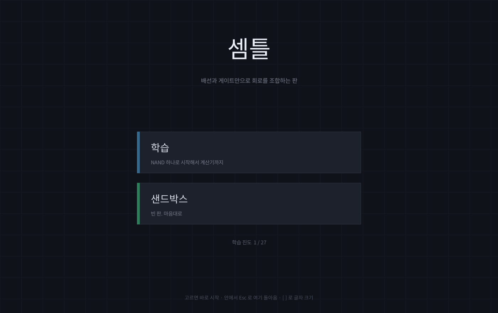
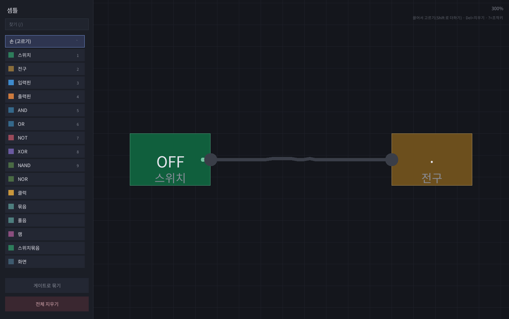
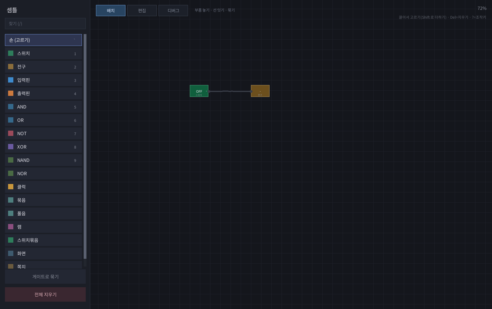
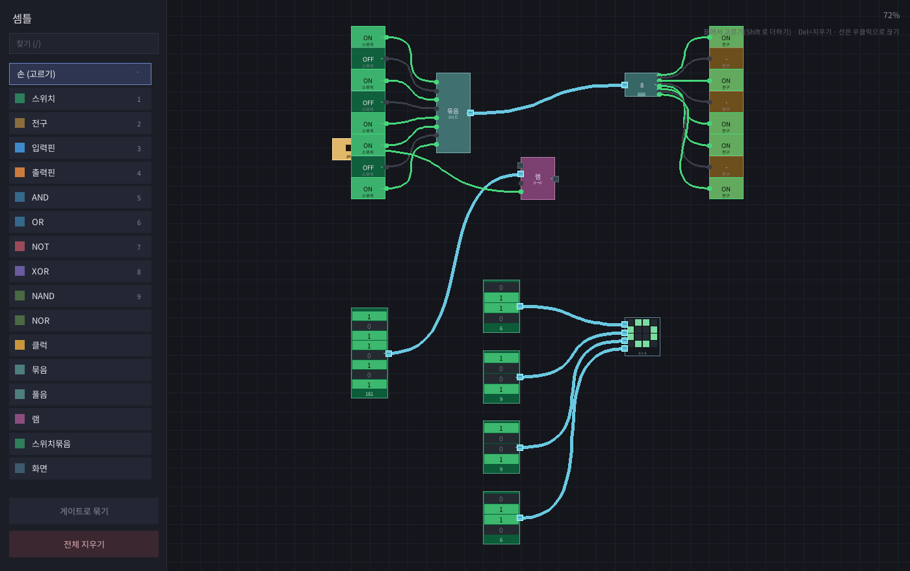
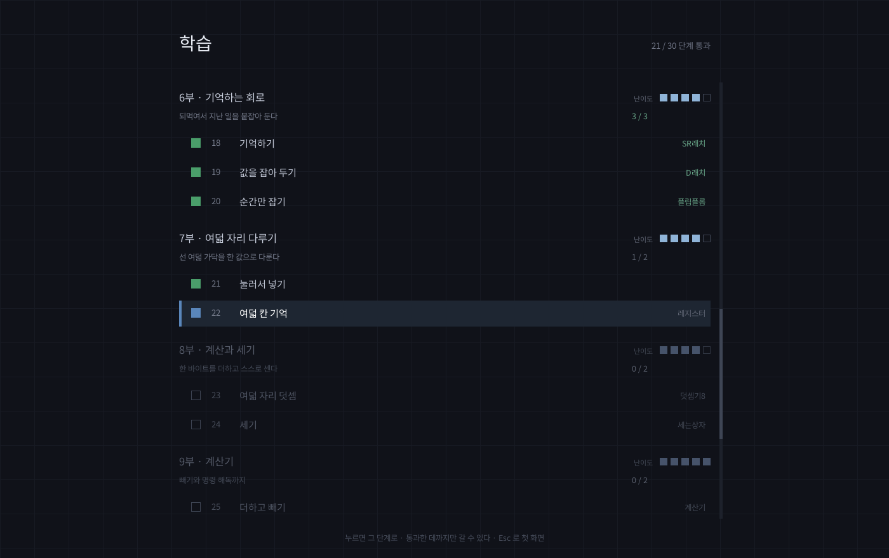
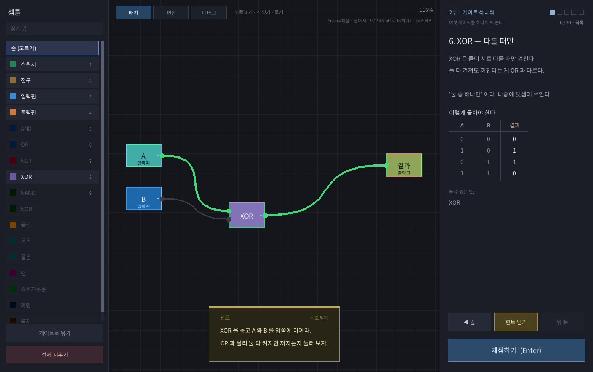
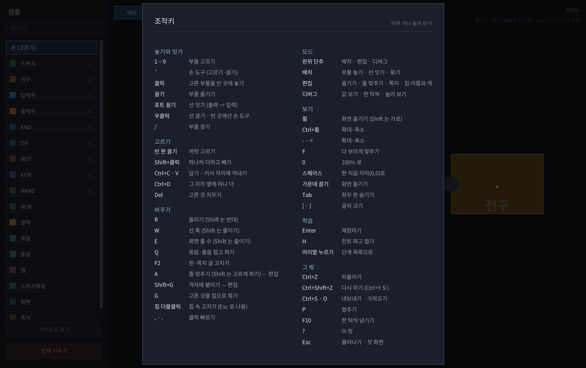
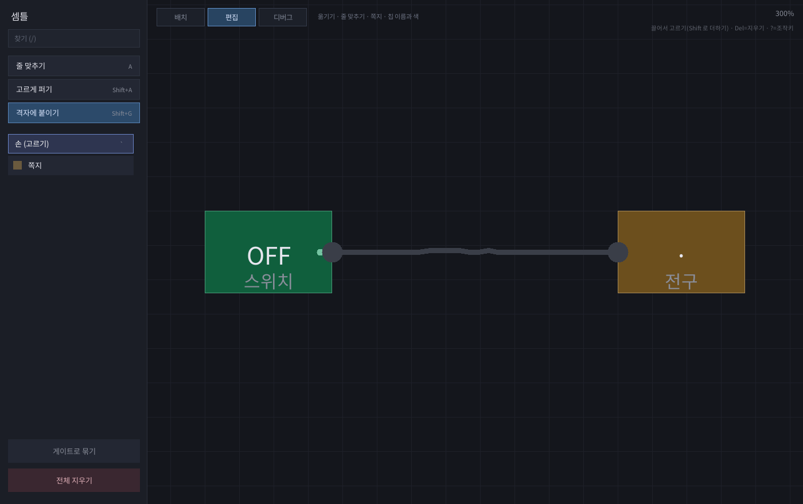

---
tags:
  - 만든 것
---

# 셈틀

!!! abstract "개요"
    **셈틀**은 [세준](세준.md)이 2026년 8월에 만든 논리 회로 판이다.
    스위치와 전구부터 시작해 게이트를 잇고, 만든 회로를 상자로 묶어
    다시 쓰면서 **스스로 도는 컴퓨터**까지 쌓아 올린다.
    C++와 SDL2로 만들었고, 스물일곱 단계짜리 학습 과정이 들어 있다.

이름은 **'컴퓨터'를 순우리말로 쓰던 말**에서 왔다 — 셈(계산) + 틀(기계).
NAND 하나에서 시작해 계산기까지 가는 판이라 뜻이 그대로 맞아서 가져다 썼다.
처음엔 「논리」였는데 너무 밋밋해서 바꿨다.

## 1. 무엇인가

부품을 판에 끌어다 놓고, 출력 점에서 입력 점으로 선을 잇는다.
스위치를 켜면 신호가 선을 타고 흘러 전구가 켜진다.

[모래](모래.md)에도 배선과 게이트가 있었지만 그건 격자 위에 픽셀로 그리는 것이었다.
이쪽은 상자와 선으로 된 **노드 그래프**라 큰 회로를 짜기에 맞다.

## 2. 한 틱 지연이 핵심이다

모든 부품이 **이번 틱 입력을 먼저 다 읽고, 그다음 한꺼번에 출력을 바꾼다.**

이게 없으면 되먹임 고리(출력이 돌고 돌아 자기 입력으로 오는 것)가 한 틱 안에
무한히 돌아 버린다. 지연이 있으면 실제 회로처럼 값이 한 칸씩 전해진다.

덕분에 **NOR 두 개를 서로 물리면 값을 기억하는 래치**가 된다. 셋 신호를 잠깐 주면
켜진 채로 남고, 리셋 신호를 잠깐 주면 꺼진 채로 남는다. 기억 소자가 게이트 두 개에서
저절로 나온다. 조합 회로와 순차 회로의 경계가 여기다.

## 3. 커스텀 게이트

만든 회로를 **상자 하나로 묶어** 부품처럼 다시 쓸 수 있다. 이게 이 판의 중심이다.

*4비트 가감산기. 전가산기를 만들어 묶고, 그것 넷을 이어 다시 하나로 묶었다.
왼쪽 목록의 `full_adder`, `adder_subtractor` 가 직접 만든 부품이다.*

포트가 될 자리에는 **입력핀·출력핀**을 놓는다. 핀에 붙인 이름이 그대로 상자의 포트
이름이 되고, 마우스를 올리면 말풍선으로 뜬다. 포트가 여럿인 상자에서 어느 점이
'합'이고 어느 게 '올림'인지 헷갈릴 일이 없다.

- 상자마다 **속 회로를 따로 복사**해 갖는다. 같은 상자를 둘 놓아도 값이 안 섞인다.
- **상자 안에 상자**도 된다. 안쪽도 똑같은 자료구조라 같은 코드로 재귀해서 돈다.
- 안에 래치가 있으면 **기억하는 상자**가 된다.

### 3.1. 고치면 전부 따라 바뀐다

*상자를 더블클릭하면 그 속으로 들어간다. 위에 파란 띠가 둘린다.*

설계도를 고치면 **이미 놓인 상자들도 다 새 설계도대로 바뀐다.** 판에 놓인 것도,
다른 상자 속에 들어 있는 것도. `full_adder` 를 고치면 그걸 쓴 4비트 가산기까지
자동으로 고쳐진다.

여기서 조심할 게 둘 있었다.

**자기 안에 자기.** 고치는 중인 상자를 판에 놓을 수 있으면 끝없이 깊어진다.
고치는 동안에는 그 상자를 목록에서 잠근다.

**포트가 줄어들 때.** 핀을 지우면 그 포트에 붙어 있던 선이 갈 곳을 잃는다.
그 선만 끊고 나머지는 그대로 둔다. 몇 개 끊겼는지 알려 준다.

## 4. 굵은 선과 부품 넷

*스위치 여덟(10110101 = 181) → 묶음 → 굵은 파란 선 하나 → 풀음 → 전구 여덟.*

컴퓨터를 만들려면 선 하나가 1비트만 나르는 걸로는 안 된다. 레지스터 둘만 이어도
화면이 선으로 뒤덮인다. 그래서 **선에 폭(1~16비트)** 을 넣었다.

- 포트마다 폭이 있고 **폭이 같아야 이어진다.** 굵은 선을 가는 구멍에 못 꽂는다
- **묶음**이 가는 선 여럿을 굵은 선 하나로, **풀음**이 도로 푼다
- **클럭** — 제 박자로 혼자 깜빡인다. 순차 회로를 눈으로 보려면 이게 있어야 한다
- **램** — 256칸 × 8비트. 래치 수백 개를 손으로 놓는 건 무리라 붙박이로 줬다.
  클럭이 올라가는 순간에만 쓰고, 읽기는 늘 한다

## 5. 학습 과정

학습을 고르면 단계 목록부터 뜬다. 서른 단계를 열한 부로 묶고, **부마다 난이도와
한 줄 소개**를 달았다. 난이도를 단계마다 매기지 않은 건 같은 부 안이 어차피 비슷한
수준이라서다. 통과한 데까지는 눌러서 되돌아갈 수 있다.

단계마다 짧은 설명과 진리표가 있고, 회로를 짜서 `Enter` 로 채점한다.
채점기는 입력을 **모든 경우로 돌려 보고** 표와 맞는지 본다. 틀리면
`A=1, B=0 일 때 결과가 0 (1 이어야 함)` 하고 어디가 틀렸는지 짚어 준다.

서른 단계다.

| | 배우는 것 |
|---|---|
| 1~2 | 선 잇기, 한 출력이 여러 곳으로 |
| 3~8 | 게이트 하나씩 — AND · OR · NOT · XOR · NAND · NOR |
| 9~11 | 여러 개 이어 쓰기, 다수결 |
| 12~15 | **NAND 하나로** NOT · AND · OR · XOR 다시 만들기 |
| 16~17 | 반가산기, 전가산기 |
| 18~20 | **기억** — SR래치 · D래치 · 플립플롭 |
| 21~22 | 스위치묶음으로 8비트 넣기, 8비트 레지스터 |
| 23~24 | 8비트 덧셈기, 세는상자(카운터) |
| 25~26 | 계산기(더하기·빼기), 명령 해독기 |
| 27~28 | 누산기, **컴퓨터** |
| 29~30 | 화면에 점 찍기, 램에 담은 그림 그리기 |

앞 단계에서 만든 것이 뒤 단계의 재료가 된다. 12단계의 NOT이 13단계 재료가 되고,
17단계의 전가산기가 23단계에서 여덟 개 이어져 덧셈기가 되고, 그게 24단계 카운터와
25단계 계산기로 간다. 마지막에는 그 전부가 한 상자에 들어간다.

### 5.1. 28단계 — 컴퓨터

명령 한 바이트가 **윗 2비트(무엇을) + 아랫 6비트(어떤 수로)** 다.
`1` = 넣기, `2` = 더하기, `0` = 멈춤.

세는상자가 램 주소를 가리키고, 램이 명령을 내놓고, 해독기가 무엇을 할지 정하고,
누산기가 담거나 더한다. 클럭 한 박자에 명령 하나가 돈다.

채점할 때 램에 `넣기 20` `더하기 22` `멈춤` 이 들어가고, 클럭을 몇 번 올려
누산기가 **42** 가 되는지 본다.

### 5.2. 기억하는 회로는 진리표로 못 잰다

18단계부터는 지난 일에 따라 답이 달라진다. 그래서 **값을 차례로 넣어 보는 대본**을
쓴다 — "이 값들을 넣고 좀 돌린 뒤 이 출력이 이 값이어야 한다" 를 여러 칸 늘어놓는다.
틀리면 몇 번째에서 무엇이 틀렸는지 말해 준다.

**SR래치는 처음에 깜빡인다.** NOR 둘이 완전히 대칭이라 동시에 값을 바꾸면
(0,0)과 (1,1)을 오간다. 실제 회로의 준안정 상태와 같은 것이고, 셋이나 리셋을
한 번 눌러 주면 자리를 잡는다.

**D래치로 카운터를 만들면 안 된다.** 클럭이 켜져 있는 내내 값이 통해서 계속 세어
버린다. 그래서 래치 둘을 이어 **올라가는 순간만** 잡는 플립플롭을 20단계에 끼워 넣었다.
처음엔 이 단계 없이 짜다가 검사에서 걸렸다.

막히면 `H` 로 힌트를 본다. 답을 통째로 알려 주지는 않고 어디부터 손대면 되는지만
짚어 준다.

## 6. 검사 73가지

화면 없이 회로만 짜서 돌려 보는 검사가 73가지 있다. 그중 제일 중요한 것은

> **학습 단계가 순서대로 풀린다**

서른 단계를 **허락된 부품만으로 실제로 풀어 본다.** 컴퓨터 단계까지 가면
프로그램이 든 램을 읽어 42를 계산하는 것까지 확인한다. 한 단계라도 못 풀면 학습 모드가
거기서 막히는데, 사람이 매번 다 풀어 보며 확인할 수는 없다. 정답이 그 단계의 규칙을
어겼는지도 같이 본다 — 12단계 정답에 몰래 AND 를 쓰면 잡힌다.

그 밖에 자리 관련 검사들은 **글자 배율 0.8배부터 2.2배까지 훑으며** 돌린다.

### 6.1. 검사가 헛돌던 일

글자 자리 검사를 여럿 만들어 두고 다 통과하길래 안심했는데, 알고 보니
**`--test` 는 글꼴을 안 읽고 있었다.** 글자 너비를 재는 함수가 폰트가 없으면 0을
돌려주므로, "이 글이 자리를 넘는가" 검사가 전부 `0 > 어떤 수` 를 보고 있었던 것이다.

검사 시작할 때 글꼴을 읽게 고쳤더니 그제야 진짜 버그가 잡혔다 — 긴 글을 접는 코드가
빈칸 없이 이어진 덩어리를 한 번만 자르고 말아서 계속 삐져나오고 있었다.

**통과하는 검사가 실제로 뭘 재고 있는지 봐야 한다.**

### 6.2. 검사가 못 잡던 것들

이번에 큰 회로를 실제로 만들어 보다가 세 가지가 드러났다. 셋 다 **검사는 통과하고
있었다.**

- **만든 게이트가 사라진다.** 판은 모드마다 따로, 칩은 한 파일에 모아 두는데,
  모드에 들어갈 때 판만 읽고 칩은 안 읽고 있었다. 그 상태로 저장하면 칩 파일이 빈
  것으로 덮인다. 학습에서만 멀쩡해 보였는데, 그건 상품 칩을 매번 다시 만들어 줘서였다
- **나중에 만든 칩을 먼저 만든 칩이 쓰면 죽는다.** 칩은 만든 차례대로 파일에 적히고
  읽을 때도 위에서부터 읽는데, 아직 안 읽은 칩을 가리키면 "없는 칩" 이 되어 그 상자가
  죽어 버렸다. 숫자 그림 열 개에 나중에 만든 가림 회로를 넣었다가 통째로 날렸다
- **`?` 를 눌러도 조작키 창이 안 뜬다.** 키를 받는 코드가 통째로 빠져 있었는데,
  화면 검사가 창을 여는 깃발을 **직접 켜고** 그렸기 때문에 다 지나갔다.
  이제 진짜 키 이벤트를 밀어 넣어서 연다

셋 다 "저장했다 다시 읽는" 데서 났다. 만들 때는 멀쩡하고 껐다 켜면 사라지는 것이라
더 늦게 드러났다.

## 7. 세 모드

판 왼위의 단추로 **배치 · 편집 · 디버그**를 오간다. 모드마다 할 수 있는 일이 다르다.

| 모드 | 할 수 있는 것 | 막힌 것 |
|---|---|---|
| **배치** | 부품 놓기 · 선 잇기 · 지우기 · 묶기 · 돌리기 · 폭 바꾸기 | 줄 맞추기, 칩 이름·색 |
| **편집** | 옮기기(격자에 붙이기) · 줄 맞추기 · 고르게 퍼기 · 쪽지 · 칩 이름과 색 | 선 잇기, 부품 놓기, 지우기 |
| **디버그** | 값 보기 · 선 따라가기 · 한 틱씩 · 스위치 눌러 보기 | 회로를 바꾸는 것 전부 |

**왼쪽 판도 모드를 따라간다.** 배치에서는 부품과 칩이 늘어서고, 편집에서는 줄 맞추기·
고르게 퍼기·격자 단추와 쪽지·칩만, 디버그에서는 멈춤·한 틱·처음 자리·다 보이게
단추만 나온다. 못 놓는 부품을 늘어놔 봐야 헷갈리기만 한다.

**왜 막나.** 8비트를 십진 세 자리로 바꾸는 회로처럼 부품이 백 개를 넘어가면, 값이
왜 이상한지 들여다보는 동안 실수로 선 하나를 끊어도 알아채기 어렵다. 디버그 모드에서는
아예 못 바꾸게 해 두면 그럴 일이 없다. 막힌 일을 하려 하면 **어느 모드에서 하는
일인지 알려 준다** — 그냥 안 먹고 마는 게 아니라.

### 7.1. 큰 회로를 만들다 나온 것들

셋 다 실제로 아쉬워서 만든 것이다.

- **선 따라가기** — 부품이나 선에 커서를 올리면 거기 닿은 선이 밝아진다.
  더블 대블처럼 선이 수십 가닥 엉키면 눈으로는 못 따라간다
- **선 값 보기** — 굵은 선에 커서를 올리면 지금 값이 십진과 이진으로 뜬다.
  예전에는 값을 보려고 화면 부품을 임시로 갖다 놓아야 했다
- **한 틱씩** — `F10`. 부품 하나 지날 때마다 한 틱이라 깊은 회로는 값이 자리잡는 데
  쉰 틱쯤 걸린다. 한 칸씩 넘기며 어디까지 번졌는지 볼 수 있다
- **줄 맞추기** — 고른 것들이 **가로로 늘어섰는지 세로로 늘어섰는지 보고** 어느 쪽으로
  맞출지 스스로 정한다. `Shift` 를 같이 누르면 처음과 끝은 두고 사이를 고르게 편다
- **쪽지** — 판에 적어 두는 글. 포트가 없어서 회로에는 안 끼어든다

## 8. 그 밖에

- **자동 저장** — 저장 단추가 없다. 바꾸고 잠깐 가만있으면 조용히 쓴다.
  학습과 샌드박스는 저장본이 따로라, 문제 풀다 샌드박스에 가도 만들던 회로가 그대로 있다
- **되돌리기** — `Ctrl+Z`. 60단계. 상자 설계도까지 같이 찍혀서 묶기 전으로도 돌아간다.
  단 **스위치를 껐다 켜는 건 안 쌓는다** — 그건 회로를 *돌려 보는* 것이지 *고치는* 게 아니다
- **글자 크기** — `[` `]` 로 80%부터 220%까지. 글자만이 아니라 판·단추·줄 간격이 다 같이 커진다
- **`Tab`** — 좌우 판이 사라지고 회로가 화면 전체를 쓴다
- 글자는 `stb_truetype.h` 로 직접 그린다. SDL_ttf 를 따로 깔 필요가 없다

## 9. 지금 상태

코드는 [Claude](https://claude.ai)와 함께 썼다. [세준](세준.md#4-작업-방식) 문서 참고.

소스는 **[github.com/sejunch/semtle](https://github.com/sejunch/semtle)** 에 있다.

| | |
|---|---|
| 코드 | `semtle.cpp` 한 파일 |
| 필요한 것 | SDL2 하나 |
| 검사 | 73가지, 전부 통과 |
| 학습 | 30단계 |
| 기간 | 2026년 8월 |

## 10. 여담

- 학습 과정을 다 만들고 나서 직접 처음부터 풀어 봤다. 열일곱 단계 다 통과했다.
  그 뒤에 열 단계를 더 붙여 컴퓨터까지 이어지게 했다.
- 마지막 단계를 채점하려면 램에 프로그램이 들어가 있어야 해서, 채점기가
  판에 놓인 램에 미리 넣어 주게 했다.
- 이름을 바꾸면서 저장본 형식의 머리말도 바뀌었는데, 옛 파일도 그대로 읽히게 해 뒀다.
  안 그러면 만들어 둔 4비트 가감산기가 날아간다.
- [모래](모래.md)가 규칙이 스스로 굴러가는 판이라면, 이쪽은 **규칙을 쌓아 올리는 판**이다.
  [한랭](한랭.md)까지 셋 다 "밑바닥에서부터 쌓는다" 는 점은 같다.

## 11. 관련 문서

- [세준](세준.md) — 만든 사람
- [모래](모래.md) — 여기 있던 배선·게이트를 떼어내 다시 만든 것
- [한랭](한랭.md) — 같이 만든 것
- [아치리눅스](아치리눅스.md) — 만든 환경
